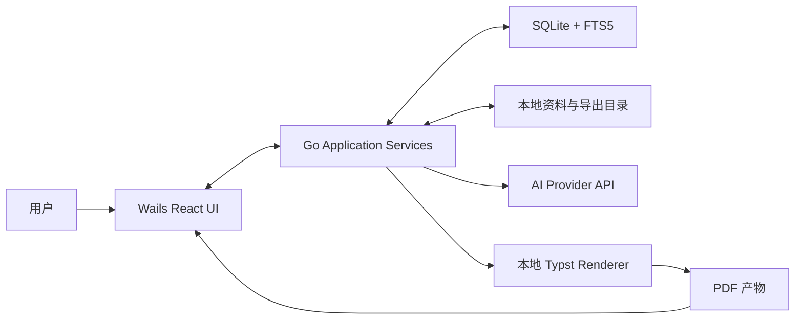

# AutoCV MVP 技术架构

> 状态：开发基线 v0.1
>
> 日期：2026-06-10
>
> 对应产品规格：[`docs/product/autocv-mvp-product-spec.md`](../product/autocv-mvp-product-spec.md)

AI 阶段的详细职责见 [`docs/architecture/ai-workflow.md`](./ai-workflow.md)。

## 1. 架构目标

本架构服务于第一阶段简历定制闭环：

```text
本地资料 -> JD -> 分析与匹配 -> 追问 -> 简历生成 -> 审阅 -> PDF
```

优先级依次为：

1. 内容可追溯和可审阅。
2. 本地数据控制。
3. 中断后可恢复。
4. AI Provider 和 PDF 渲染可替换。
5. 先完成 macOS 单机 MVP，再扩展平台和能力。

## 2. 已确定的技术选择

| 领域 | MVP 选择 | 说明 |
| --- | --- | --- |
| 桌面框架 | Wails 3 | Go 持有业务和系统能力，前端使用系统 WebView |
| 核心语言 | Go | 工作流、存储、AI 调用、解析、渲染编排 |
| 前端 | React + TypeScript + Vite | 负责工作台、审阅、预览和配置 |
| 本地数据库 | SQLite | 单机、事务、迁移简单 |
| 搜索 | SQLite FTS5 | 对来源片段和 Evidence 做本地检索 |
| AI 接入 | Provider 接口 + OpenAI 首个适配器 | MVP 不把业务逻辑绑定到具体模型 |
| AI SDK | OpenAI 官方 Go SDK | 使用结构化输出；版本在脚手架阶段锁定 |
| PDF | Typst 模板 + 本地 Typst CLI | `kami` 作为视觉质量参考，不作为运行时依赖 |
| 密钥 | 操作系统 Keychain | SQLite 只保存 Provider 配置，不保存明文密钥 |
| 配置 | 本地配置文件 + SQLite | 非敏感全局配置使用文件，业务记录进入 SQLite |
| 日志 | Go 结构化日志 | 默认脱敏，不记录完整简历/JD/Prompt |

### 2.1 版本策略

- 初始化项目时锁定 Go、Wails、Node 和依赖版本。
- 不在架构文档写死具体补丁版本。
- 升级必须通过数据库迁移、结构化输出、PDF 和打包测试。

### 2.2 暂不引入

- Agent 框架。
- 云数据库。
- 向量数据库。
- 消息队列。
- 微服务。
- 前端复杂状态管理框架。

MVP 的 AI 阶段由 Go 工作流显式编排。只有在真实代码出现重复编排问题时才评估 Agent 框架。

## 3. 系统上下文



边界：

- SQLite、资料文件和导出文件位于本机。
- 只有任务需要的 JD、Evidence 和指令发送给 AI Provider。
- Typst 在本机执行，不发送用户内容。
- React 前端不能直接访问数据库、文件系统或密钥。

## 4. 分层与模块

```text
frontend/
  React UI
       |
       | generated Wails bindings + events
       v
app/
  Application Services
       |
       v
domain/
  Entities + Policies + Workflow
       |
       v
ports/
  Repository / Provider / Parser / Renderer interfaces
       |
       v
adapters/
  SQLite / OpenAI / Markdown / DOCX / PDF / Typst / Keychain
```

### 4.1 `domain`

包含不依赖 Wails、SQLite、OpenAI 和 Typst 的核心规则：

- Profile、Evidence、JD、Requirement、Match、Resume、ResumeRun。
- 匹配分计算。
- 包装档位规则。
- 内容真实性规则。
- 锁定规则。
- 工作流状态转换。

`domain` 不执行网络、文件和数据库操作。

### 4.2 `app`

编排用例：

- 创建和管理 Profile。
- 导入资料。
- 创建 JD。
- 启动、继续、取消和重试 Resume Run。
- 回答追问。
- 锁定或解锁内容。
- 生成 Markdown。
- 渲染和导出 PDF。
- 导出和删除本地数据。

应用服务控制事务和权限边界，但不包含 Provider 特有请求结构。

### 4.3 `ports`

稳定接口：

```text
ProfileRepository
RunRepository
SearchIndex
AIProvider
DocumentParser
ResumeRenderer
SecretStore
Clock
```

实际接口应按用例拆小，避免形成单个大接口。以上名称表示架构端口，不是最终代码签名。

### 4.4 `adapters`

- `sqlite`: 仓储、迁移、FTS 索引。
- `openai`: AI 请求、结构化输出、重试和用量信息。
- `markdown`: Markdown 导入。
- `docx`: OOXML 文本和结构提取。
- `pdftext`: 文本型 PDF 提取。
- `typst`: Resume 到 Typst/PDF。
- `keychain`: API Key 读写。
- `filesystem`: 受管理资料、缓存和导出文件。

### 4.5 `frontend`

前端按用户任务组织，而不是按后端表组织：

- Profile Library。
- JD Workspace。
- Match Review。
- Clarification。
- Resume Studio。
- PDF Preview。
- Settings。

前端只保存临时界面状态。可恢复业务状态必须由 Go 和 SQLite 持有。

## 5. 运行目录

使用操作系统应用数据目录，建议结构：

```text
AutoCV/
  autocv.db
  config.json
  sources/
    <profile-id>/
      <document-id>/
  runs/
    <run-id>/
      artifacts/
      render/
  exports/
  logs/
  backups/
```

规则：

- 文件名不作为业务 ID。
- 用户导入文件进入受管理目录后使用随机 ID 命名，原始名称存数据库。
- 临时文件只放在 Run 目录，成功后原子替换正式产物。
- 删除业务记录时同步清理受管理文件。
- 数据库启动时检查 schema version，并按顺序执行迁移。

## 6. 数据模型

### 6.1 主要表

| 表 | 关键字段 |
| --- | --- |
| `profiles` | `id`, `name`, `default_language`, `created_at`, `updated_at` |
| `source_documents` | `id`, `profile_id`, `kind`, `original_name`, `managed_path`, `content_hash`, `parse_status` |
| `source_chunks` | `id`, `document_id`, `ordinal`, `text`, `locator_json` |
| `evidence` | `id`, `profile_id`, `kind`, `title`, `content`, `confidence`, `user_verified` |
| `evidence_sources` | `evidence_id`, `chunk_id`, `quote_start`, `quote_end` |
| `job_descriptions` | `id`, `title`, `company`, `raw_text`, `language`, `analysis_json` |
| `requirements` | `id`, `jd_id`, `kind`, `text`, `importance`, `hard_constraint` |
| `resume_runs` | `id`, `profile_id`, `jd_id`, `status`, `stage`, `packaging_level`, `language` |
| `stage_results` | `id`, `run_id`, `stage`, `input_hash`, `status`, `result_json`, `error_json` |
| `clarification_questions` | `id`, `run_id`, `question`, `reason`, `status`, `answer` |
| `matches` | `id`, `run_id`, `requirement_id`, `strength`, `explanation` |
| `match_evidence` | `match_id`, `evidence_id` |
| `resumes` | `id`, `run_id`, `version`, `structure_json`, `markdown`, `created_at` |
| `resume_blocks` | `id`, `resume_id`, `kind`, `ordinal`, `content`, `locked` |
| `block_sources` | `block_id`, `evidence_id`, `relation`, `risk_level` |
| `artifacts` | `id`, `run_id`, `kind`, `path`, `content_hash`, `created_at` |
| `provider_configs` | `id`, `provider`, `base_url`, `model`, `secret_ref`, `enabled` |

### 6.2 ID 与时间

- 业务 ID 使用 UUID。
- 时间统一存 UTC，界面显示本地时间。
- 所有可编辑主对象包含 `created_at` 和 `updated_at`。
- Resume 采用追加版本，不原地覆盖已导出的版本。

### 6.3 JSON 使用边界

JSON 适合：

- AI 原始结构化结果。
- Stage 输入输出快照。
- Resume 的层级结构。
- 错误详情。

关系字段适合：

- Profile、JD、Requirement、Evidence、Match 和 Source Reference。
- 需要筛选、关联和约束的数据。

不得把全部业务数据塞进单个 JSON 文档。

## 7. 核心结构化 Schema

### 7.1 JD Analysis

```json
{
  "role": "string",
  "company": "string|null",
  "level": "string|null",
  "language": "zh|en|mixed",
  "responsibilities": [
    {
      "id": "string",
      "text": "string",
      "importance": 1,
      "hard_constraint": false
    }
  ],
  "required_skills": [],
  "preferred_skills": [],
  "domain_signals": [],
  "screening_constraints": [],
  "ambiguities": []
}
```

### 7.2 Evidence

```json
{
  "id": "string",
  "kind": "experience|project|skill|education|certification|achievement",
  "title": "string",
  "facts": ["string"],
  "capabilities": ["string"],
  "source_chunk_ids": ["string"],
  "confidence": 0.0,
  "user_verified": false
}
```

### 7.3 Match Result

```json
{
  "requirement_id": "string",
  "strength": "strong|partial|missing|unknown",
  "evidence_ids": ["string"],
  "explanation": "string",
  "clarification_needed": false
}
```

### 7.4 Resume

```json
{
  "language": "zh|en",
  "target_role": "string",
  "blocks": [
    {
      "id": "string",
      "kind": "summary|experience|project|skill|education|certification",
      "content": "string",
      "locked": false,
      "source_evidence_ids": ["string"],
      "grounding_level": "source|derived|user_confirmed"
    }
  ]
}
```

所有 AI 结构化输出必须：

- 在 Go 侧做 Schema 校验。
- 拒绝未知枚举值。
- 保存输入摘要、Provider、模型和响应元数据。
- 校验失败时只自动修复一次。

## 8. 工作流

### 8.1 阶段

```text
profile_ready
  -> jd_analyzed
  -> matched
  -> requires_user_input
  -> drafted
  -> reviewed
  -> rendered
  -> completed
```

每个阶段状态：

```text
pending | running | succeeded | failed | skipped | cancelled
```

### 8.2 执行规则

- 同一个 Resume Run 同时只能有一个阶段处于 `running`。
- 阶段开始前保存输入 Hash。
- 相同输入 Hash 且已有成功结果时允许复用。
- 上游结果变化后，标记受影响的下游阶段为 `pending`。
- 锁定块参与重新生成输入，并在 Go 侧校验输出未修改。
- 用户取消 AI 请求后保存 `cancelled`，不删除已有阶段结果。

### 8.3 状态机所有权

状态机由 Go 持有。前端只能请求命令并订阅事件，不能自行推进业务阶段。

## 9. AI 边界

### 9.1 AI 负责

- 来源资料结构化。
- JD 结构化。
- Requirement 与 Evidence 的语义关联建议。
- 澄清问题草拟。
- Resume 草稿生成。
- 表达质量和 JD 覆盖审阅。

### 9.2 Go 负责

- 数据选择和最小上下文构建。
- Schema 校验。
- 匹配分计算。
- 内容等级和量化规则。
- 锁定内容保护。
- 状态转换。
- 重试、取消、超时和持久化。
- PDF 产物管理。

### 9.3 Provider 接口

Provider 接口暴露任务能力，不暴露厂商 API 细节：

```text
ExtractProfile
AnalyzeJD
SuggestMatches
GenerateQuestions
DraftResume
ReviewResume
```

每个任务使用独立请求和响应类型。禁止提供一个通用 `Chat(prompt string)` 作为业务层主要接口。

### 9.4 Prompt 管理

- Prompt 模板作为版本化资源进入仓库。
- 每次 Stage Result 记录 Prompt 版本。
- Prompt 不直接拼接 SQL 或文件路径。
- 私有样本不写入 Prompt fixture。

## 10. 文档解析

### 10.1 Markdown

- 首个垂直闭环实现。
- 保留标题、列表和段落顺序。
- 原始文本按标题和长度切分 Source Chunk。

### 10.2 DOCX

- MVP 发布前实现。
- 使用 Go 标准库 `archive/zip` 读取 OOXML 包，使用 `encoding/xml` 解析 `word/document.xml`；不在 MVP 引入第三方 DOCX 解析依赖。
- 读取 OOXML 正文、标题、列表和表格中的文本。
- 不要求还原原始视觉布局。
- 图片、页眉页脚和复杂文本框可提示为未完整支持。

### 10.3 PDF

- MVP 只支持含文本层的 PDF。
- 使用 `github.com/ledongthuc/pdf` 从内存 reader 读取文本层，并按页生成 Source Chunk。
- 提取后执行可读性检查；文本过少时判定为可能扫描件。
- 不做 OCR。
- 页码和文本范围进入 `locator_json`，用于来源跳转。

解析器统一返回：

```text
DocumentMetadata + Ordered Source Chunks + Warnings
```

## 11. PDF 渲染

### 11.1 决策

MVP 使用 Typst：

```text
Resume JSON
  -> Go View Model
  -> Typst data/template
  -> typst compile
  -> PDF
```

原因：

- 输出文本可选择，适合基础 ATS 读取。
- 模板可版本化和测试。
- 比直接操作 PDF 坐标更容易维护。
- 中英文排版和分页控制优于简单 Markdown 转 PDF。

### 11.2 运行方式

- macOS 包中携带已验证的 Typst CLI，或在开发期使用固定路径。
- Go 使用参数数组启动进程，不通过 shell 拼接命令。
- 每次渲染使用独立临时目录。
- 设置超时并捕获标准错误摘要。
- 成功后原子移动到 Artifact 路径。
- 渲染元数据写入 Rendered Stage Result：
  - 固定期望 Typst CLI：`typst 0.14.2`。
  - 固定模板版本：`resume.typ/v1`。
  - 同时记录实际 `typst --version` 输出，便于排查环境差异。

### 11.3 模板边界

首个闭环只有一个模板：

- 单栏。
- ATS 友好。
- 中文和英文共用数据结构。
- 字体和字号可按语言切换；模板区分正文与标题字体栈。
- 中文正文优先使用 `Charter` + `Songti SC`，标题优先使用 `PingFang SC`。
- 英文正文优先使用 `Charter`，标题优先使用 `Avenir Next`。
- Markdown 链接和裸 URL 在 PDF 中渲染为 Typst `link`。
- Section 标题和首条内容使用不可拆分块，单条内容也不跨页拆分，避免标题悬空和孤行。
- 默认两页目标，不通过缩小到不可读字号强行压页。

`kami` 用于比较视觉质量，不作为 AutoCV 运行时组件。

## 12. Wails 前后端契约

### 12.1 命令

前端通过生成的 TypeScript Binding 调用应用服务，例如：

```text
ProfileService.Create
ProfileService.ImportDocument
JDService.CreateFromText
RunService.Start
RunService.AnswerQuestions
RunService.RetryStage
ResumeService.UpdateMarkdown
ResumeService.SetBlockLock
ResumeService.RenderPDF
ExportService.ExportResume
SettingsService.SaveProvider
```

命令返回稳定 DTO，不直接返回数据库实体。

### 12.2 事件

Go 通过 Wails Event 发布：

```text
run.stage.started
run.stage.progress
run.stage.succeeded
run.stage.failed
run.requires_user_input
artifact.created
```

事件只用于进度和通知。页面刷新后必须能通过查询接口恢复完整状态。

## 13. 安全与隐私

- API Key 存入 Keychain，数据库只保存引用。
- 日志中的用户文本使用长度、Hash 和 ID 代替。
- 错误上报默认关闭。
- 导出诊断包时默认不包含用户原文。
- AI 请求日志只记录 Provider、模型、任务、耗时、Token 用量和状态。
- 删除 Profile 时事务性删除数据库记录，并清理受管理文件。
- 外部命令只允许执行应用内配置的 Typst 二进制，不接受用户提供的任意命令。

## 14. 测试架构

### 14.1 单元测试

- 匹配分。
- 内容等级和量化规则。
- 锁定块合并。
- 状态转换。
- 输入 Hash 和阶段失效。
- Resume 到 Typst View Model。

### 14.2 合约测试

- AI Provider fixture 到 Schema。
- Parser 输入到 Source Chunk。
- Repository CRUD 和事务。
- Typst 模板编译。

### 14.3 集成测试

- 临时 SQLite 数据库执行迁移和完整 Run。
- Fake Provider 返回固定结构化结果。
- 合成资料完成 Markdown 到 PDF。

### 14.4 端到端测试

- Wails 开发模式下验证关键界面。
- 至少覆盖创建 Profile、导入、粘贴 JD、运行、审阅和导出。
- 私有真实样本只做本地验收，不进入 CI。

## 15. 建议代码结构

```text
autoCV/
  cmd/autocv/
  internal/
    app/
    domain/
    ports/
    adapters/
      sqlite/
      openai/
      parser/
      renderer/
      keychain/
    workflow/
  migrations/
  prompts/
  templates/
    resume/
  frontend/
    src/
      features/
      components/
      bindings/
  testdata/
    synthetic/
  docs/
```

## 16. 架构决策记录

| ID | 决策 | 状态 |
| --- | --- | --- |
| ADR-001 | Wails 3 + Go + React/TypeScript | 已接受 |
| ADR-002 | SQLite 持久化，FTS5 本地检索 | 已接受 |
| ADR-003 | Go 显式工作流，不引入 Agent 框架 | 已接受 |
| ADR-004 | Provider 任务接口，OpenAI 首个适配器 | 已接受 |
| ADR-005 | Typst 作为 MVP PDF 渲染器 | 已接受 |
| ADR-006 | macOS 为首发平台 | 已接受 |
| ADR-007 | 未确认量化值不得进入最终简历 | 已接受 |

以下实现细节允许在不改变产品契约的情况下通过 Spike 调整：

- SQLite Go Driver。
- DOCX/PDF 解析库。
- Keychain 封装库。
- OpenAI 具体模型。
- Typst 字体组合。
